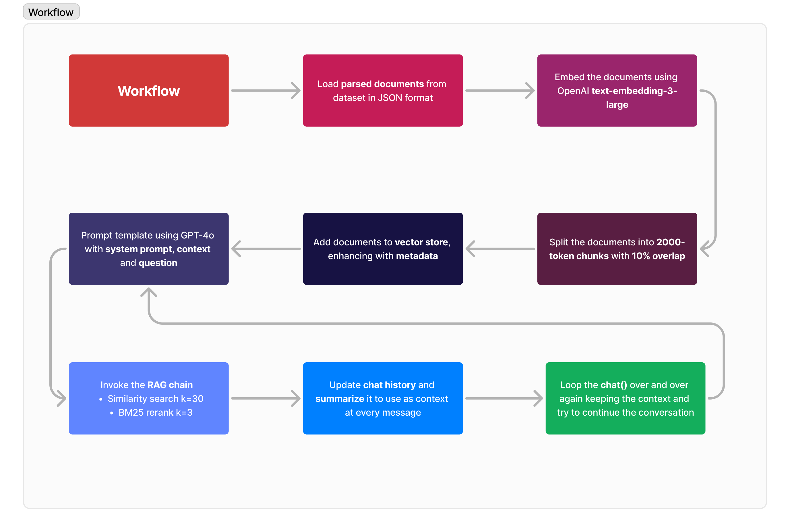

# Neural Wave Hackaton
- **Team Name**: \<teamName\>
- **Project Name**: Swisscom project \<teamName\>
- **Hackathon**: NeuralWave 
- **Date**: October 25-27, 2024
- **Team Members**:
    - Tornike Onoprishvili
    - Riccardo Sacco
    - Carla Lopez Zurita
    - Roberts Kalvitis
    - Michele Smaldone

### Project Description
While Swisscom has a fully functional chatbot implemented on their website, we believe there is still room for improvement. The original chatbot sometimes presents issues with consistency when the user switches languages, which is a common occurrence given Switzerland's multilingual setting. Other considerations include providing helpful references within the Swisscom website, as well as offering truly useful responses to users' questions. Our goal is to create an effective chatbot that assists users with a variety of issues, beating performance of the currently implementing chatbot. The chatbot should:
- Detect language and apply it to conversation correctly;
- Filter out irrelevant user questions;
- Give users useful responses that are based on Swisscom’s publicly available data on their website.    

<div style="text-align: center;">
  
</div>

### Project report
Can be found at {place location}.

### Project video
Can be found at {url}.


### Folder structure
TODO this needs changing at the end, when file cleanup is done
```text
    ├── assets
    │   └── prompts.md
    ├── chroma
    ├── data
    │   ├── botresults
    │   │   └── results___.json
    │   ├── inputs.json
    │   ├── output.json
    │   └── test_data.json
    ├── notebooks
    │   └── evaluate_results.ipynb
    ├── src
    │   ├── __init__.py
    │   ├── ai_judge.py
    │   ├── chat.py
    │   ├── evaluator.py
    │   ├── ingest_documents.py
    │   ├── make_predictions.py
    │   ├── swisscom_rag_chat.py
    │   └── swisscom_rag.py
    ├── LICENSE.md
    ├── README.md
    └── requirements.txt
```

### Installing Dependencies
To install the necessary packages listed in `requirements.txt`, run the following command:

```bash
pip install -r requirements.txt
```

### Create a `.env` File

1. In the root directory of your project, create a new file named `.env`. Use `.env.example` as an example.
   
2. Open the `.env` file and add your API key as follows:

```plaintext
OPENAI_API_KEY=your_api_key_here
```

### Download the dataset
1. Download the dataset from https://swisscom-my.sharepoint.com/:u:/p/stefano_taillefert/EegWIyF8835PuUXsyuzmGGsBcxu7gFVcJVhyOpLVhZ_g4A?e=nsivZN
2. place it in the `root directory` and run command in terminal.
```bash
unzip dataset.zip
```
## Running json evaluation

1. Place the `input.json` in `data/ `
2. Run predictions
```bash
python src/make_predictions.py
```
3. Results are in `data/output.json`


## Running project chat from terminal


### Ingest the document base:
```bash
python src/ingest_documents.py
```

### Run chat:

```bash
python src/chat.py
```


